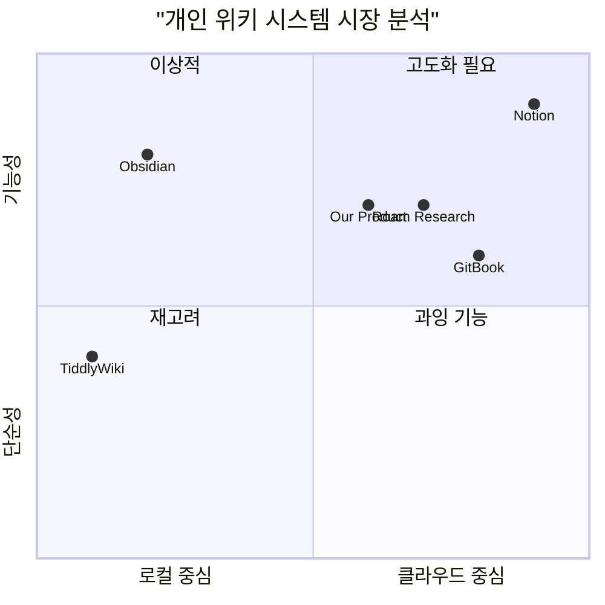

# Personal Markdown Wiki System PRD

## 1. 개요

### 1.1 프로젝트 정보
- 프로젝트명: Personal Markdown Wiki
- 프로그래밍 언어: React, JavaScript, Tailwind CSS
- 데이터베이스: Supabase
- 주요 라이브러리: marked.js (마크다운 변환), vis.js (그래프 시각화)

### 1.2 요구사항 요약
개인용 마크다운 위키 시스템 개발
- Supabase 기반 사용자 인증
- 마크다운 편집 및 실시간 프리뷰
- vis.js를 활용한 그래프 뷰 시각화
- 데이터 저장 및 동기화
- 가져오기/내보내기 기능
- 다크/라이트 모드 테마

## 2. 제품 정의

### 2.1 제품 목표
1. 사용자가 마크다운으로 지식을 쉽게 정리하고 연결할 수 있는 개인 위키 시스템 제공
2. 직관적인 문서 간 연결 관계 시각화로 지식 관리 효율성 향상
3. 안전하고 신뢰할 수 있는 클라우드 기반 데이터 저장 및 동기화 제공

### 2.2 사용자 스토리
1. 사용자 인증
   - "나는 사용자로서 구글 계정으로 간편하게 로그인하여 내 데이터에 안전하게 접근하고 싶다."
   - "나는 사용자로서 여러 기기에서 동일한 계정으로 접근하여 데이터를 동기화하고 싶다."

2. 문서 관리
   - "나는 작성자로서 마크다운으로 문서를 작성하고 실시간으로 프리뷰를 확인하고 싶다."
   - "나는 작성자로서 문서 간의 연결 관계를 쉽게 만들고 시각적으로 확인하고 싶다."
   - "나는 독자로서 태그와 검색 기능을 통해 원하는 문서를 빠르게 찾고 싶다."

### 2.3 경쟁사 분석

1. Obsidian
장점:
- 강력한 마크다운 편집 기능
- 로컬 파일 기반 동작
- 다양한 플러그인
단점:
- 동기화에 유료 구독 필요
- 웹 접근성 제한

2. Notion
장점:
- 직관적인 UI/UX
- 강력한 협업 기능
- 다양한 블록 지원
단점:
- 마크다운 지원 제한적
- 데이터 내보내기 제한

3. GitBook
장점:
- 깔끔한 문서화
- GitHub 연동
- 버전 관리
단점:
- 학습 곡선이 높음
- 실시간 협업 제한

4. Roam Research
장점:
- 양방향 링크
- 강력한 그래프 뷰
- 데일리 노트
단점:
- 높은 구독료
- 복잡한 인터페이스

5. TiddlyWiki
장점:
- 단일 HTML 파일
- 높은 확장성
- 무료 사용
단점:
- 투박한 UI
- 진입장벽 높음

### 2.4 경쟁사 분석 차트



## 3. 기술 명세

### 3.1 요구사항 분석
1. 프론트엔드
   - React 기반 SPA 구현
   - Tailwind CSS로 반응형 디자인
   - marked.js로 마크다운 파싱
   - vis.js로 그래프 시각화

2. 백엔드 (Supabase)
   - 사용자 인증 및 권한 관리
   - 실시간 데이터 동기화
   - 문서 저장 및 검색

3. 데이터 모델
   - 사용자 정보
   - 문서 데이터
   - 태그 및 메타데이터
   - 문서 간 연결 정보

### 3.2 요구사항 풀

P0 (필수 구현)
- 사용자 인증 (Google OAuth)
- 마크다운 편집기 및 프리뷰
- 문서 저장 및 동기화
- 기본 검색 기능
- 다크/라이트 모드

P1 (권장 구현)
- 그래프 뷰 시각화
- 태그 시스템
- 문서 내보내기/가져오기
- 실시간 자동 저장
- 문서 버전 관리

P2 (선택 구현)
- 이미지 업로드
- 문서 공유 기능
- 플러그인 시스템
- 모바일 최적화
- 오프라인 지원

### 3.3 UI 설계 초안

```mermaid
graph TD
    A[메인 화면] --> B[좌측 사이드바]"Documents, Tags, Search"
    A --> C[중앙 편집기]"Editor, Preview"
    A --> D[우측 사이드바]"Graph View, Meta Info"
    B --> E[문서 목록]
    B --> F[태그 클라우드]
    B --> G[검색바]
    C --> H[마크다운 편집기]
    C --> I[실시간 프리뷰]
    D --> J[그래프 뷰]
    D --> K[문서 정보]
```

### 3.4 주요 화면 구성

1. 메인 화면
   - 3단 레이아웃 (사이드바-편집기-그래프뷰)
   - 반응형 디자인 (모바일에서는 슬라이딩 패널)
   - 테마 전환 버튼
   - 사용자 프로필 메뉴

2. 편집기 화면
   - 마크다운 문법 도구 모음
   - 실시간 프리뷰
   - 자동 저장 표시
   - 전체 화면 모드

3. 그래프 뷰
   - 확대/축소 컨트롤
   - 노드 필터링
   - 문서 간 연결 표시
   - 클릭하여 문서 열기

### 3.5 주요 기능 명세

1. 문서 관리
   - 새 문서 생성
   - 실시간 저장
   - 문서 삭제 및 복구
   - 문서 이동 및 정렬

2. 마크다운 지원
   - 기본 문법 (제목, 목록, 링크 등)
   - 수학 수식 (KaTeX)
   - 코드 하이라이팅
   - 표 편집

3. 데이터 동기화
   - 실시간 클라우드 저장
   - 오프라인 캐싱
   - 충돌 해결
   - 동기화 상태 표시

### 3.6 추가 검토 사항

1. 보안
   - 데이터 암호화
   - 접근 권한 관리
   - 백업 정책

2. 성능
   - 대용량 문서 처리
   - 그래프 뷰 최적화
   - 검색 인덱싱

3. 확장성
   - API 설계
   - 플러그인 아키텍처
   - 타 서비스 연동

## 4. 오픈 질문

1. 기술적 고려사항
   - Supabase의 실시간 동기화 성능은 대규모 문서에서도 충분한가?
   - vis.js의 그래프 뷰 성능은 수백 개의 노드에서도 안정적인가?

2. 사용자 경험
   - 모바일에서의 편집 경험을 어떻게 최적화할 것인가?
   - 오프라인 모드에서의 동기화 충돌을 어떻게 해결할 것인가?

3. 비즈니스
   - 향후 유료 기능은 어떤 것들을 고려할 수 있는가?
   - 다른 노트 앱과의 차별화 포인트를 어떻게 강화할 것인가?
